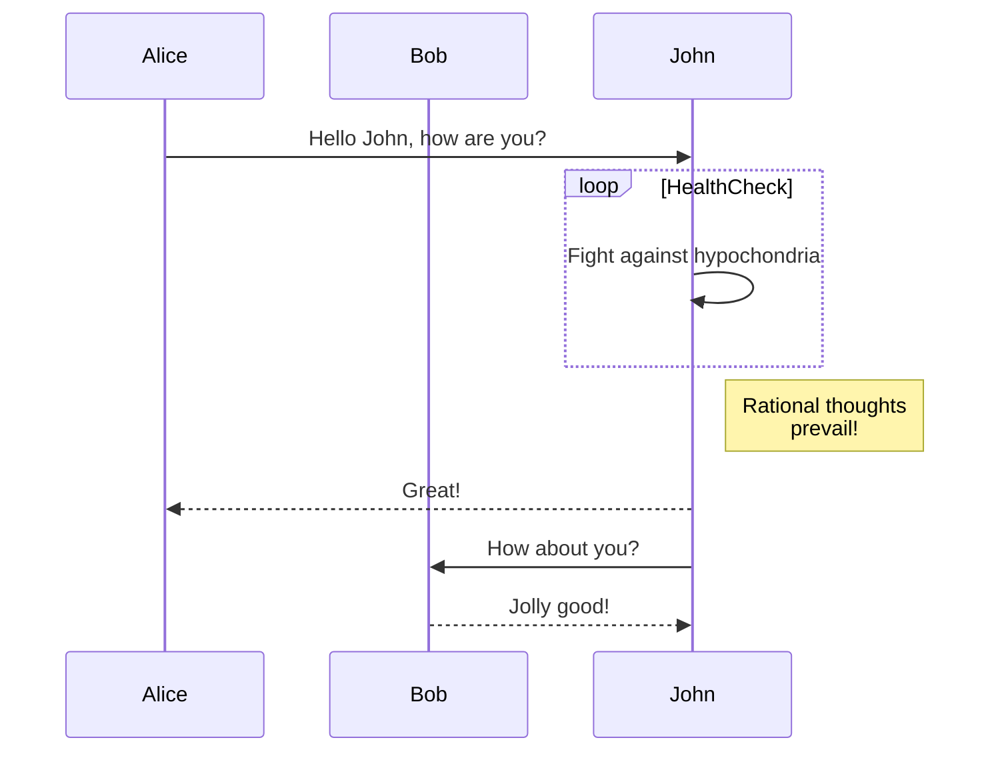
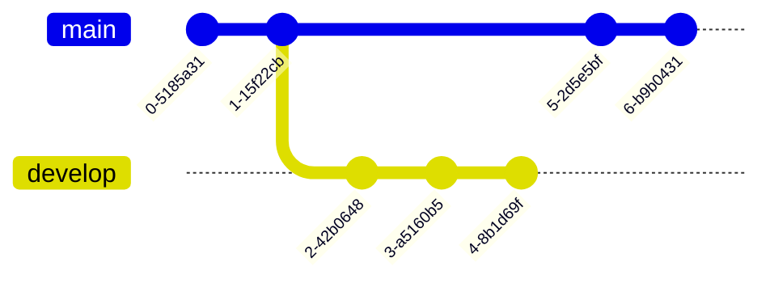

# Rédiger du contenu en Markdown

Cecil prend en charge la syntaxe [Markdown](https://cecil.app/documentation/content/#markdown) dans les fichiers `.md`, ainsi que le [front matter](https://cecil.app/documentation/content/#front-matter) pour définir des variables.

## Style inline

Le texte peut être en **gras**, _italique_ ou ~~barré~~.

```markdown
Text can be **bold**, _italic_, or ~~strikethrough~~.
```

Vous pouvez [créer un lien vers une page](/about.md) ou [vers une autre page](page:index).

```markdown
You can [link to a page](/about.md) or [to another page](page:index).
```

Vous pouvez mettre en évidence du `code inline` avec des accents graves.

```markdown
You can highlight `inline code` with backticks.
```

## Structurer une page

Cecil utilise automatiquement le nom du fichier comme titre de la page, mais vous pouvez également définir le titre et d’autres variables dans le [front matter](https://cecil.app/documentation/content/#front-matter).

Vous pouvez structurer le contenu à l’aide d’un titre. En Markdown, les titres sont indiqués par un certain nombre de `#` au début de la ligne.

```yaml
---
title: Page title
description: Page short description.
---

Lorem ipsum dolor sit amet, consectetur adipiscing elit, sed do eiusmod tempor incididunt ut labore.

## Heading

Lorem ipsum dolor sit amet, consectetur adipiscing elit, sed do eiusmod tempor incididunt ut labore.
```

## Image

Les images utilisent la prise en charge intégrée des ressources optimisées de Cecil.


```markdown

```

Cecil recherche les images dans les répertoires `assets/` et `static/`, mais les chemins relatifs sont également pris en charge :

```markdown

```

## Liste

* Élément de liste non ordonnée
* Élément de liste non ordonnée
* Élément de liste non ordonnée

1. Élément de liste ordonnée
2. Élément de liste ordonnée
3. Élément de liste ordonnée

* Niveau 1
  * Niveau 2
  * Niveau 2
    * Niveau 3
    * Niveau 3

```markdown
* Unordered list
* Unordered list
* Unordered list

1. Ordered list
2. Ordered list
3. Ordered list

* Level 1
  * Level 2
  * Level 2
    * Level 3
    * Level 3
```

## Citation

> Ceci est une citation, couramment utilisée pour citer une autre personne ou un autre document.
>
> Les citations sont indiquées par un `>` au début de chaque ligne.

```markdown
> This is a blockquote, which is commonly used when quoting another person or document.
>
> Blockquotes are indicated by a `>` at the start of each line.
```

## Bloc de code

Un bloc de code est indiqué par un bloc délimité par trois accents graves ` ``` ` au début et à la fin. Vous pouvez indiquer le langage utilisé après les accents graves d’ouverture.

```php
// PHP code
$config = [
    'title'   => "My website",
    'baseurl' => 'http://localhost:8000/',
];

Builder::create($config)->build();
```

<pre>
```php
// PHP code
$config = [
    'title'   => "My website",
    'baseurl' => 'http://localhost:8000/',
];

Builder::create($config)->build();
```
</pre>

## Ligne horizontale

---

```markdown
---
```

## Liste de définitions

Premier terme
: Voici la définition du premier terme.

Deuxième terme
: Voici une définition du deuxième terme.
: Voici une autre définition du deuxième terme.

```markdown
First Term
: This is the definition of the first term.

Second Term
: This is one definition of the second term.
: This is another definition of the second term.
```

## Tableau

| En-tête 1 | En-tête 2 | En-tête 3 |
|:----------|:----------|:----------|
| ok        | bon poisson suédois | sympa |
| épuisé    | bon assortiment | sympa |
| ok        | bons `oreos` | hmm |
| ok        | bonne réglisse salée | miam |

```markdown
| Head 1       | Head 2            | Head 3 |
|:-------------|:------------------|:-------|
| ok           | good swedish fish | nice   |
| out of stock | good and plenty   | nice   |
| ok           | good `oreos`      | hmm    |
| ok           | good `zoute` drop | yumm   |
```

## Notes

:::
vide
:::

:::info
information
:::

:::tip
astuce
:::

:::important
important
:::

:::warning
avertissement
:::

:::caution
attention
:::

```markdown
:::info|tip|important|warning|caution
Note here.
:::
```

## Diagrammes et graphiques

Créez des diagrammes et des graphiques avec [Mermaid](https://mermaid.js.org).

### Diagramme de séquence



<pre>

</pre>

### Graphe Git



<pre>

</pre>
